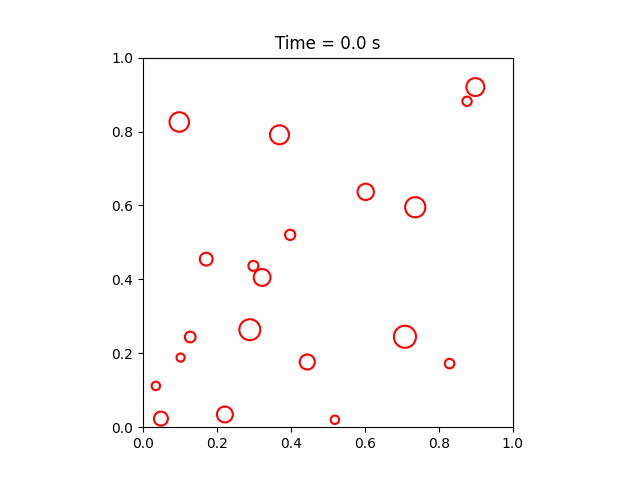

.. ParticlesInBoxLive documentation master file, created by
   sphinx-quickstart on Thu Jun 17 15:38:11 2021.
   You can adapt this file completely to your liking, but it should at least
   contain the root `toctree` directive.

Welcome to ParticlesInBoxLive's documentation!
==============================================

This is an example project to show how to set up scientific computing python projects.

In the demo we went through:

 - Basics of git
 - Unit testing with pytest
 - Pre-commit hooks
 - Setting up simple continuous development pipeline
 - Making project documentation with Sphinx
 - Publishing documentation in readthedocs.io

.. toctree::
   :maxdepth: 2
   :caption: Contents:

   documentation

Indices and tables
==================

* :ref:`genindex`
* :ref:`modindex`
* :ref:`search`
